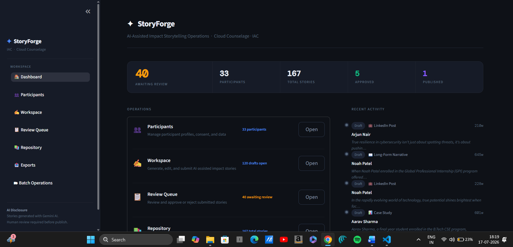
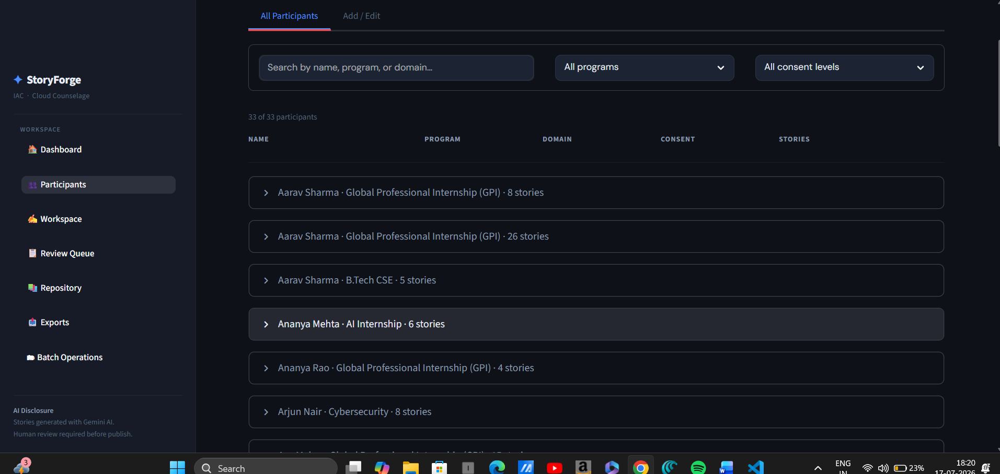
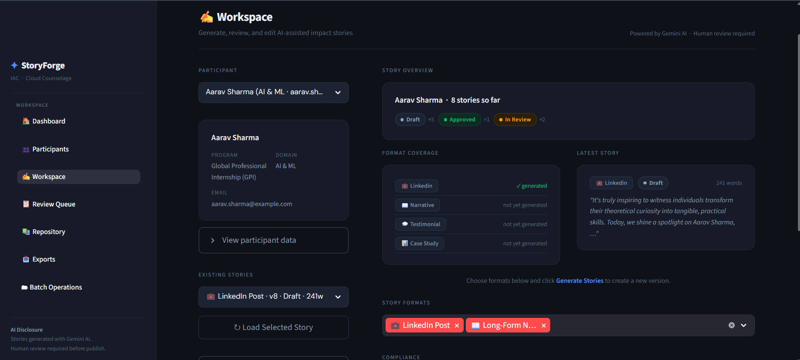
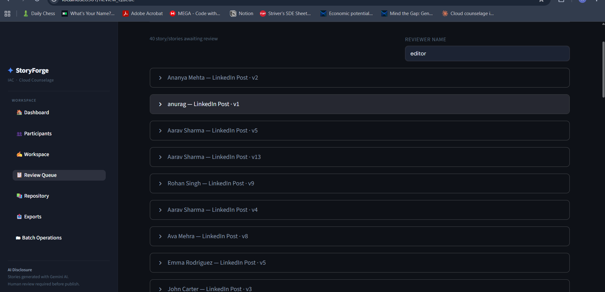
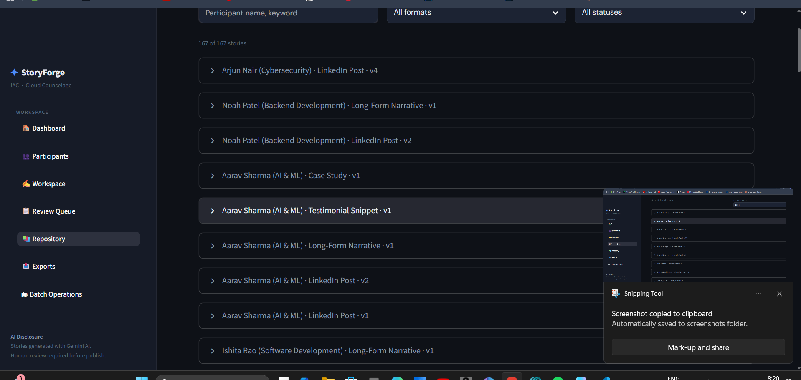
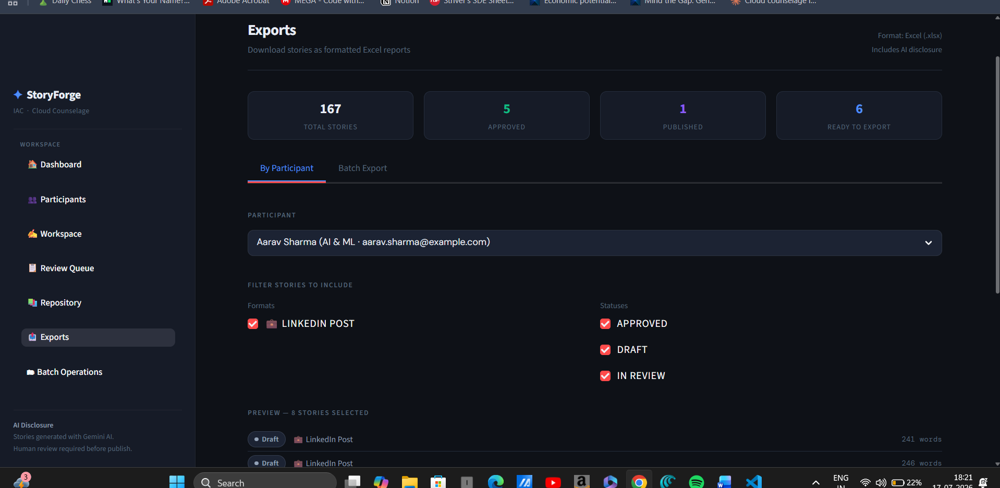
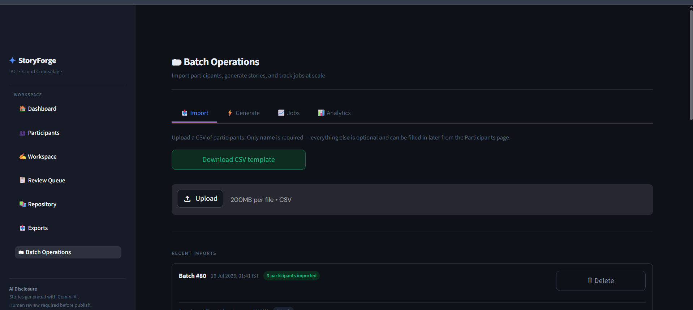

<div align="center">

# StoryForge

### AI-Assisted Editorial Storytelling Platform

*A modular workflow platform for participant management, AI-powered story generation, editorial review, repository management, batch processing, and structured exports.*


(https://storyforge-2sc5b9eikrib5dmc9mahsb.streamlit.app)
</div>

---

## 🌐 Live Demo

**StoryForge is deployed on Streamlit Community Cloud.**

👉 https://krish-toryforge.streamlit.app

# Overview

StoryForge is an operational storytelling platform designed to streamline the complete lifecycle of AI-assisted impact stories.

Rather than functioning as a chatbot or prompt generator, StoryForge provides a structured workflow for managing participants, generating stories with Google Gemini, reviewing content, publishing approved stories, maintaining a searchable repository, processing batch operations, and exporting structured reports.

The application follows a modular architecture that separates presentation, business logic, AI integration, persistence, and export functionality.

---
# Application Screenshots

## Dashboard



---

## Participants



---

## Workspace



---

## Review Queue



---

## Repository



---

## Export Center



---

## Batch Operations



# Key Features

## Participant Management

- Create, edit, and manage participant profiles
- Store structured participant metadata
- Support CSV imports for large participant sets
- Maintain participant consent information

---

## AI Story Generation

- Google Gemini integration
- Structured prompt generation
- Multiple story formats
- Sequential generation workflow
- Draft creation
- Story regeneration

---

## Editorial Workflow

- Draft management
- Editorial review queue
- Approval and rejection workflow
- Editor notes
- Story version tracking

---

## Repository

- Centralized story library
- Search and filtering
- Publication tracking
- Repository statistics
- Story history

---

## Batch Operations

- CSV import
- Batch job tracking
- Sequential AI generation
- Retry support
- Progress monitoring

---

## Export Center

- Excel exports
- Repository reports
- Structured data output

---

# Workflow

```text
Participants
      │
      ▼
Workspace
      │
      ▼
Prompt Builder
      │
      ▼
Google Gemini
      │
      ▼
Draft Stories
      │
      ▼
Review Queue
      │
      ▼
Approved Stories
      │
      ▼
Repository
      │
      ▼
Export Center
```

---

# Architecture

```text
                    StoryForge

              Streamlit UI Layer
 ┌───────────────────────────────────────────┐
 │ Dashboard                                 │
 │ Participants                              │
 │ Workspace                                 │
 │ Review Queue                              │
 │ Repository                                │
 │ Export Center                             │
 │ Batch Operations                          │
 └───────────────────────────────────────────┘
                    │
                    ▼

             Service Layer

 db_service.py
 gemini_service.py
 prompt_builder.py
 batch_service.py
 export_service.py
 excel_service.py

                    │
                    ▼

             SQLite Database
```

---

# Technology Stack

| Layer | Technology |
|--------|------------|
| Frontend | Streamlit |
| Language | Python |
| AI | Google Gemini |
| Database | SQLite |
| Export Engine | OpenPyXL |
| Configuration | python-dotenv |

---

# Project Structure

```text
StoryForge/
│
├── app.py
├── pages/
│   ├── Participants
│   ├── Workspace
│   ├── Review Queue
│   ├── Repository
│   ├── Export Center
│   └── Batch Operations
│
├── services/
│   ├── db_service.py
│   ├── gemini_service.py
│   ├── prompt_builder.py
│   ├── batch_service.py
│   ├── export_service.py
│   └── excel_service.py
│
├── components/
├── core/
├── docs/
├── outputs/
├── README.md
└── requirements.txt
```

---

# Getting Started

## Clone the repository

```bash
git clone https://github.com/<your-username>/StoryForge.git
cd StoryForge
```

---

## Create a virtual environment

### Windows

```bash
python -m venv .venv
.venv\Scripts\activate
```

### macOS / Linux

```bash
python3 -m venv .venv
source .venv/bin/activate
```

---

## Install dependencies

```bash
pip install -r requirements.txt
```

---

## Configure environment variables

Create a `.env` file in the project root.

```env
GEMINI_API_KEY=YOUR_API_KEY
GEMINI_MODEL=gemini-2.5-flash
```

---

## Run StoryForge

```bash
streamlit run app.py
```

---

# Documentation

Detailed documentation is available in the `docs/` directory.

- Architecture
- Database Design
- Workflow
- Deployment Guide
- User Guide

---

# Design Principles

StoryForge is built around the following principles:

- Modular architecture
- Service-oriented design
- Centralized configuration
- Shared UI components
- Single SQLite database
- Editorial-first workflow
- Participant-centric storytelling
- Maintainable codebase

---

# Current Capabilities

- Participant management
- AI-assisted story generation
- Editorial review workflow
- Repository management
- Batch generation
- Excel exports
- Audit logging
- SQLite persistence
- Sequential Gemini generation

---

# Future Enhancements

Planned improvements include:

- User authentication
- Role-based access control
- Multi-user collaboration
- PostgreSQL support
- Background job processing
- REST API
- Cloud deployment
- Analytics dashboard

---

# License

This project is licensed under the MIT License.

See the `LICENSE` file for details.

---

# Author

**Krish Raina**

Computer Engineering Student

AI • Software Engineering • Workflow Automation

---

# Acknowledgements

- Streamlit
- Google Gemini
- SQLite
- OpenPyXL

---

<div align="center">

### StoryForge

*From participant onboarding to published stories — one integrated workflow.*

</div>